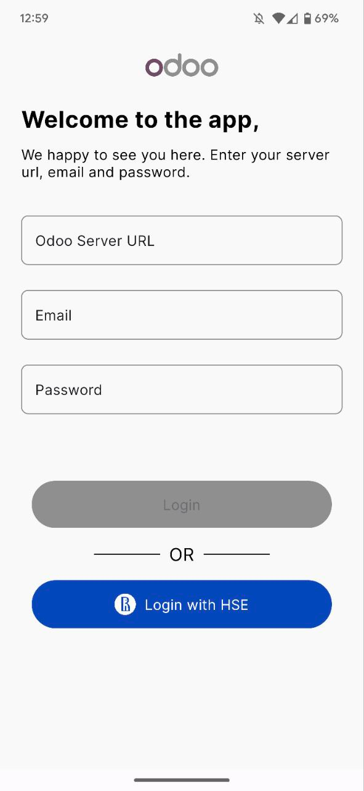
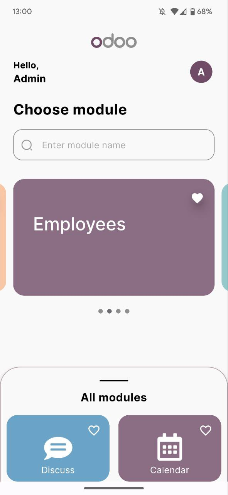
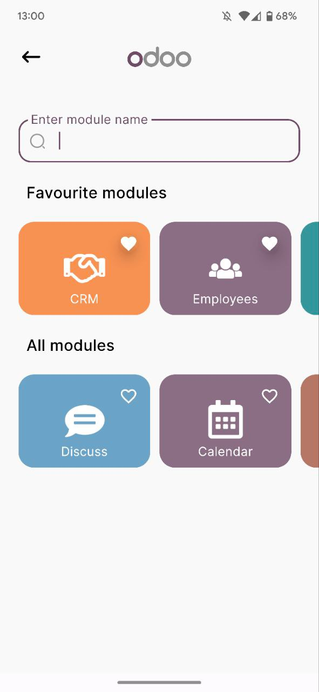
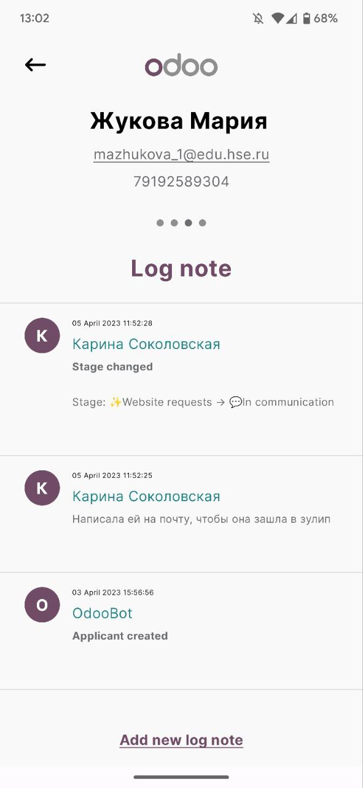
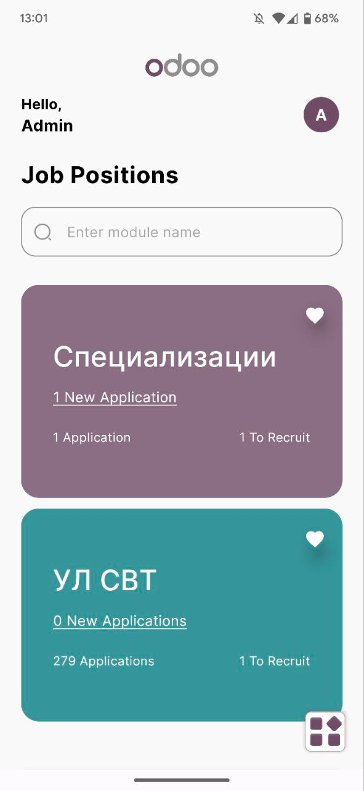
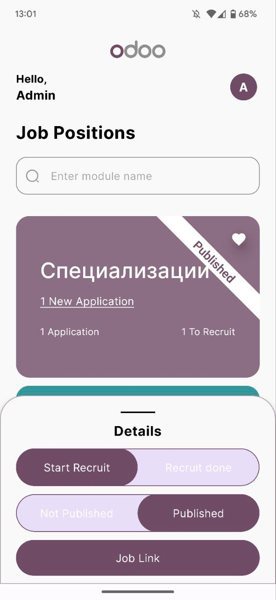
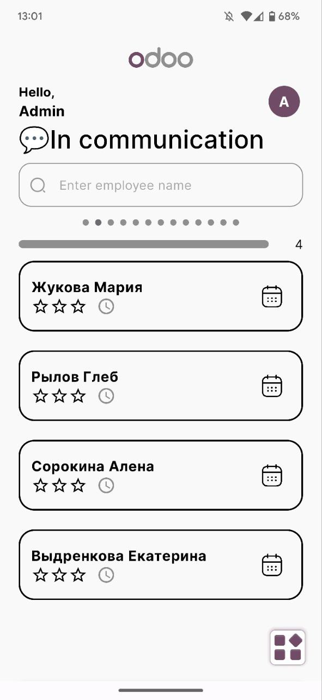
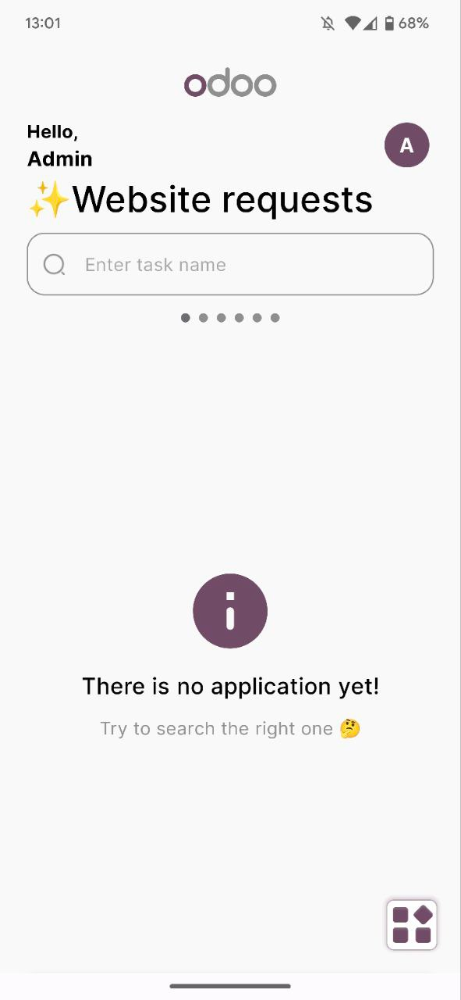
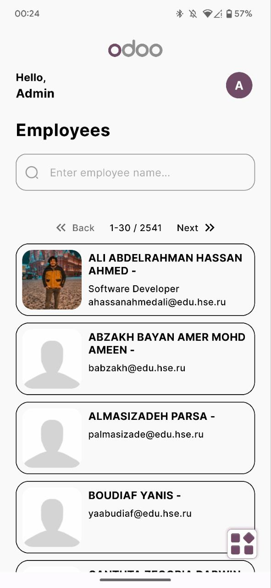
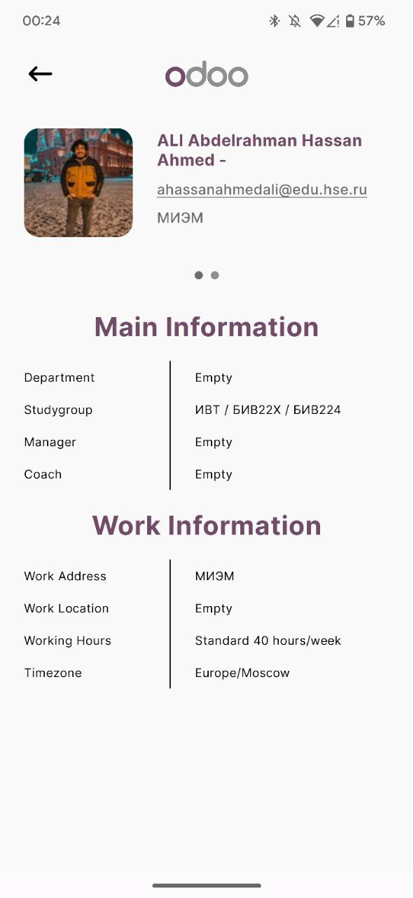

# OdooMobileX

## Description
> This is **unofficial** [Odoo](https://www.odoo.com/) mobile client for Android with [HSE](https://www.hse.ru/en/) support. Enjoy!

## Features
- Authorization
  - General
  - HSE
- Selecting modules
  - Pick your favorite
  - Looking for the right module
- Recruitment module
  - View available job
  - Open or close a job post, also get link of job
  - Start hiring or finish
  - Kanban of applications for vacancies
  - Search for kanban applications and view detailed information
- CRM module
  - Viewing the CRM kanban
  - Creating CRM kanban statuses
  - Viewing detailed information
  - Viewing of Log notes and Schedule activities
- Profile
  - Viewing of general info about user
  - Log out from current session
- Employees
  - Viewing list of employees
  - Get detailed info about employee
  - Search employee

## Example of screens
 

  

 

 

 

## Stack
- Kotlin
- Jetpack Compose
- RxJava
- Clean Architecture + MVVM
- And other interesting staff

## Are you a developer?
Check [README](documentation/README.md) for developers

Keep in touch ＼(＾▽＾)／