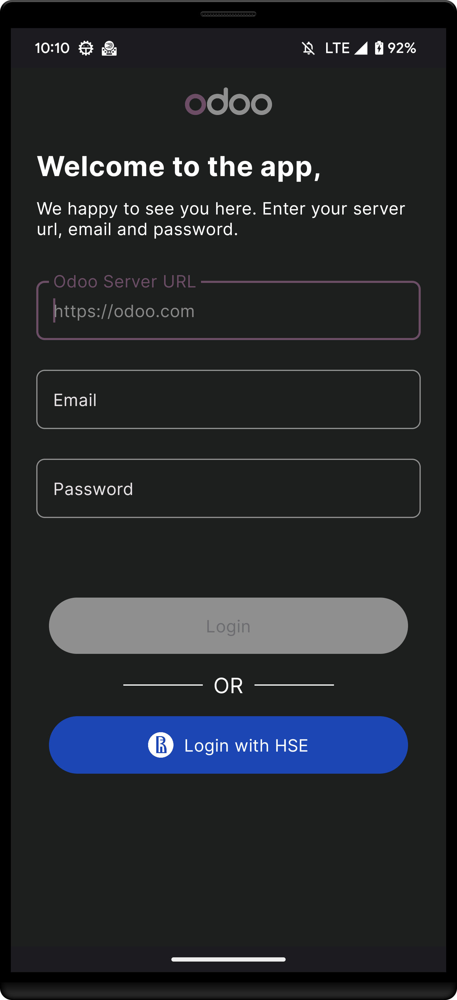

# OdooApp

## Description
> This is **unofficial** [Odoo](https://www.odoo.com/) mobile client for Android with [HSE](https://www.hse.ru/en/) support. Enjoy!

## Features
- Authorization
  - General
  - HSE
- Selecting modules, pick your favorite
- Recruitment module `coming soon!`
- CRM module `coming soon!`
- Profile `coming soon!`

## Example of screens
 

## Stack
- Kotlin
- Jetpack Compose
- RxJava
- Clean Architecture + MVVM
- And other interesting staff

## Are you a developer?
Check [README](documentation/README.md) for developers

## Download
Stable release coming soon, keep in touch ＼(＾▽＾)／